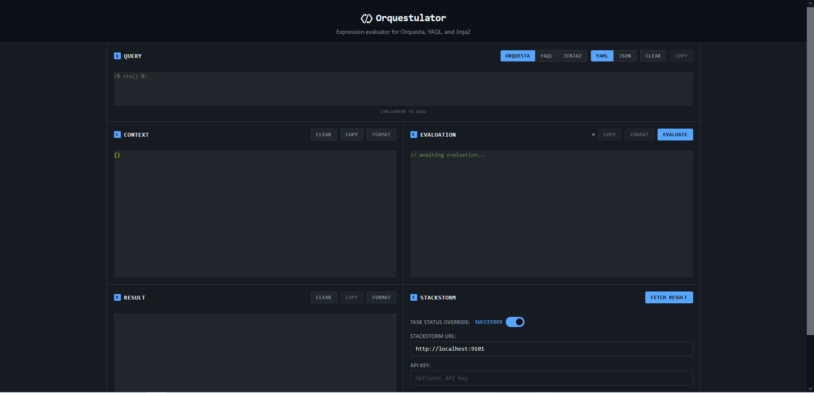

# Orquestulator



A web-based tool for developing and testing StackStorm's Orquesta expressions. Orquestulator provides a secure sandbox environment for evaluating Orquesta, YAQL, and Jinja2 expressions StackStorm.

## Overview

Orquestulator is specifically designed for StackStorm workflow development, providing an interactive environment to test expressions before deploying them to production. The tool connects directly to your StackStorm instances, allowing you to validate workflow expressions using actual execution context and data.

**Key Features:**
- **StackStorm Integration**: Connect to live StackStorm instances and test with real execution data
- **Orquesta Workflow Support**: Primary focus on StackStorm's native workflow language
- **Multi-expression Testing**: Support for YAQL and Jinja2 expressions used in StackStorm
- **Secure Evaluation**: Sandboxed execution environment
- **Session Management**: Configure connections to multiple StackStorm environments

**Important**: Orquestulator uses in-memory session storage and **must run with a single worker** for session consistency. The application is designed for small teams.

## Deployment

### Docker (Recommended)

```bash
git clone https://github.com/gtg46/orquestulator.git
cd orquestulator
docker-compose up -d
```

Access the application at `http://localhost`

### nginx Configuration

The included nginx configuration provides:
- Reverse proxy to backend API
- Static file serving for frontend
- Docker Compose service discovery

Production deployments should:
- Enable HTTPS
- Configure proper firewall rules
- Set up log rotation
- Use environment variables for secrets

## Development

### Local Setup

**Backend:**
```bash
cd backend
python3 -m venv .venv
pip install -r requirements.txt
uvicorn app.main:app --host "$BACKEND_HOST" --port "$BACKEND_PORT" --reload
```

**Frontend:**
```bash
cd frontend
npm install
npm run dev
```

Access development server at `http://localhost:5173`

### Project Structure

```
├── backend/          # FastAPI application
│   ├── app/
│   │   ├── routes/   # API endpoints (StackStorm integration)
│   │   ├── models/   # Pydantic schemas
│   │   └── lib/      # Authentication & config
│   └── config/       # StackStorm connection configs
├── frontend/         # React application
│   └── src/
│       ├── components/
│       ├── api/
│       └── hooks/
```

## Usage

### Expression Examples

**Orquesta**
```yaml
# Workflow task transitions
expression: <% succeeded() and ctx().deploy_environment = 'production' %>
context: {"deploy_environment": "production"}

# Data transformation for StackStorm
expression: <% ctx().servers.select($.status = 'active') %>
context: {"servers": [{"name": "web1", "status": "active"}]}
```

**YAQL**
```yaml
expression: $.servers.where($.status = 'active').name
data: {"servers": [{"name": "web1", "status": "active"}]}
```

**Jinja2:**
```jinja2
expression: |
  
  {{ server.name }}: {{ server.ip }}
  
data: {"servers": [{"name": "web1", "ip": "10.0.1.1"}]}
```

### StackStorm Integration

**Required Configuration** - Configure your StackStorm instance in `backend/config/stackstorm-connections.json`:

```json
{
  "connections": {
    "default": {
      "name": "Production StackStorm",
      "url": "https://your-stackstorm-instance",
      "api_key": "your-api-key"
    }
  }
}
```

## Technology Stack

### Backend
- **FastAPI**: Modern Python web framework
- **Pydantic**: Data validation and serialization
- **YAQL**: Query language for structured data
- **Jinja2**: Template engine
- **Orquesta**: Workflow engine
- **HTTPX**: HTTP client for StackStorm integration

### Frontend
- **React 19**: Modern UI framework
- **Vite**: Fast build tool and development server
- **Monaco Editor**: VS Code-like code editor
- **js-yaml**: YAML parsing and serialization

### Infrastructure
- **Docker**: Containerization
- **Docker Compose**: Multi-service orchestration
- **Nginx**: Production web server
- **Python 3.12**: Runtime environment
- **Node.js 22**: Frontend build environment